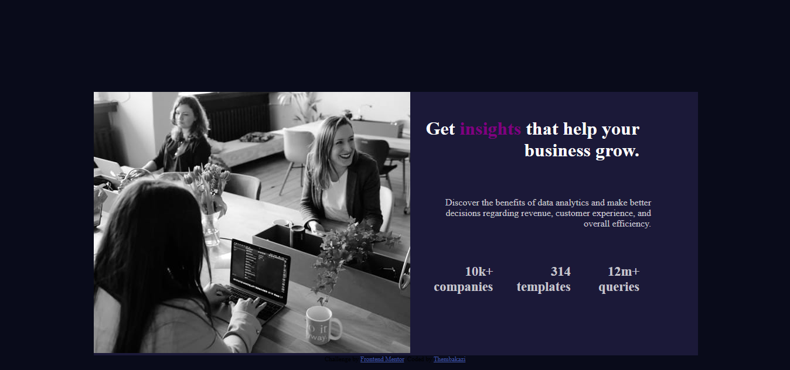

# Frontend Mentor - Stats preview card component solution

This is a solution to the [Stats preview card component challenge on Frontend Mentor](https://www.frontendmentor.io/challenges/stats-preview-card-component-8JqbgoU62). Frontend Mentor challenges help you improve your coding skills by building realistic projects. 

## Table of contents

- [Overview](#overview)
  - [The challenge](#the-challenge)
  - [Screenshot](#screenshot)
  - [Links](#links)
- [My process](#my-process)
  - [Built with](#built-with)
  - [What I learned](#what-i-learned)
  - [Continued development](#continued-development)
  - [Useful resources](#useful-resources)
- [Author](#author)
- [Acknowledgments](#acknowledgments)


## Overview

### The challenge

Users should be able to:

- View the optimal layout depending on their device's screen size

### Screenshot




### Links

- Solution URL: [Add solution URL here](https://github.com/ThembakaziNgamlana/stats-preview-card-component.git)
- Live Site URL: [Add live site URL here](https://thembakazingamlana.github.io/stats-preview-card-component/)

## My process

### Built with

- Semantic HTML5 markup
- CSS custom properties
- Flexbox
- CSS Grid
- Mobile-first workflow


### What I learned

i have learned how to make the website responsive and by using media query and i have learned hoow to use display block and display none.

```html
<h1>Some HTML code I'm proud of</h1>

<div class="attribution">
  Challenge by <a href="https://www.frontendmentor.io?ref=challenge" target="_blank">Frontend Mentor</a>. 
  Coded by <a href="#">Thembakazi</a>.
</div>
```css
.proud-of-this-css {
.img_desktop {
    display: none;
  }

  .images_mobile {
    display: block;
    max-width: 100%; 
  }
}
```


### Continued development

Use this section to outline areas that you want to continue focusing on in future projects. These could be concepts you're still not completely comfortable with or techniques you found useful that you want to refine and perfect.


### Useful resources

- [w3school.com](https://www.w3schools.com/cssref/pr_border-style.php) - This helped me to make my webpage beutiful using css styling. I really liked this pattern and will use it going forward.
- [youTube](https://www.youtube.com/watch?v=ZYV6dYtz4HA) - This is an amazing video which helped me to make my website responsive. I'd recommend it to anyone still learning this concept.


## Author


- Frontend Mentor - [ThembakaziNgamlana](https://www.frontendmentor.io/profile/ThembakaziNgamlana)


